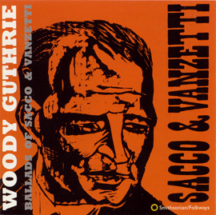

## Two Good Men

{.left} [Sacco and Vanzetti](http://saccoandvanzetti.org/) are two names that any vaguely left-leaning person will recognize. Come to that, maybe right-leaning ones will too. Their story is simple; known anarchists, they were framed for a murder that “they almost surely didn’t commit,” according to [Entertainment Weekly](https://willowpondfilms.com/filmography/sacco-and-vanzetti/), which skirts the issue nicely.[^fn1] After seven years on death row in Boston, Mass., they were executed on 23 August 1927. Not surprisingly, Folkways Records’ Moe Asch asked Woody Guthrie to commemorate the pair in song, the subject of Program 13 in the [Sounds to Grow On](https://folkways.si.edu/sounds-to-grow-on-sacco-and-vanzetti-program-13/music/podcast/smithsonian) series. Important though the story is, though, surely no-one can really think this is Guthrie at his troubadoring best. Most of the songs are OKish, but nothing special. Which just goes to show that a good subject doesn’t necessarily make for a good song.

Michael Asch saved the best, and best-known, of the songs almost to the end: [Two Good Men](Two-Good-Men.mp3). The final track on the album is Pete Seeger’s setting of Nicola Sacco’s final letter to his wife, which is an astonishing listen, but it seemed unfair and perverse[^fn2] to pick a Pete Seeger song to point to a Woody Guthrie record.

[^fn1]: The film from which I lifted that review quote sounds worth looking out for. 

[^fn2]: Rather like executing Sacco and Vanzetti. 
