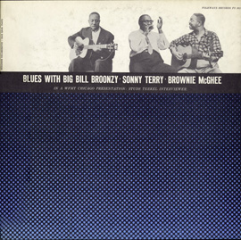

## The Blues

{.left} Program 14 of CKUA’s radio series Sounds to Grow On was built around a radio programme broadcast on [WFMT Chicago](https://www.wfmt.com/) in 1957. The astonishing [Studs Terkel](https://www.wfmt.com/programs/best-of-studs-terkel/) broadcast on WFMT from 1952 to 1997, and Folkways Records turned  one of the programmes he made into the album [Blues with Big Bill Broonzy, Sonny Terry and Brownie McGhee](https://folkways.si.edu/sounds-to-grow-on-talking-about-the-blues-program-14/music/podcast/smithsonian). Terkel and his guests do their best to explore what the blues is, without coming to any kind of satisfactory conclusion, which is just as it should be. At one point, the three musicians are encouraged to improvise, and produce a fine track labelled simply The Blues on the track listing. Terkel tries to work out what precisely they were doing. Fortunately, you don’t have to. [You just have to listen](Talking-About-the-Blues-Program-14.mp3). In the interests of accuracy, I should point out that when I was editing the track down from the original podcast, I became pretty convinced that there was a cut between the end of the talking and the start of the playing. Maybe the improvisation wasn’t quite as good as it might have been first time around.
