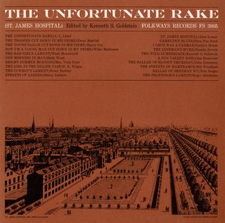

## Saint James Progress 

{.left} One song, 20 versions, and there are probably lots more. The Unfortunate Rake (programme 3) is to date the most informative programme I’ve heard in the CKUA Radio series Sounds to Grow On. Sure, I knew The Saint James Infirmary and Streets of Laredo, but I’d never thought of the connections between them. I had absolutely no idea that the St. James Infirmary was originally St James’ Palace in London. And of course I also had no idea that there’s heaps of [scholarship](https://www.jstor.org/pss/1496993) associated with the song in all its guises.

Michael Asch played some of the songs collected on the Folkways album [The Unfortunate Rake](https://folkways.si.edu/sounds-to-grow-on-the-unfortunate-rake-program-5/music/podcast/smithsonian). He pointed out that the very earliest version contains the ceremonial funeral that runs like a thread through all the various versions.
<pre>
    My jewel, my joy, don't trouble me with the drum,
    Sound the dead march as my corpse goes along;
    And over my dead body throw handfuls of laurel,
    And let them all know that I'm going to my rest.
</pre>

And for each version he played, he highlighted that verse. Wondrous. So, how to pick just one of the songs? Impossible, so I went for nostalgia and picked Dave van Ronk’s Gambler's Blues (which he also sings as St James Infirmary on other albums).
<pre>    
    I want six crap shooters for pall bearers,
    A chorus girl to sing me a song.
    Put a jazz band on my hearse wagon,
    Raise hell as I stroll along.
</pre>

[Sing it Dave](Gamblers-Blues.mp3).
