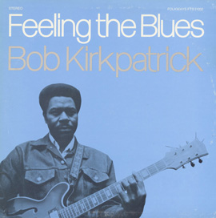

## Stormy Monday

“Everything is word of mouth,” said the Famous Writer, as I asked him for a recommendation. Which is a good reason to start something I've been meaning to do for a long time. Michael Asch has been presenting a series on CKUA Radio, in Canada (and everywhere else) built around the recordings his father Moe Asch made at Folkways Records. I can‘t now remember where I heard about it, but I subscribed to the podcasts and have been listening to them for a few weeks. Some of them are downright freaky, and not every track on every show is a gem, but there‘s usually at least one, often more, that send me scrabbling for a pen and paper.

{.left} I thought I‘d share a track from time to time, not least to maybe send you on over to listen to the whole thing. I‘m linking here to the [Smithsonian‘s site for the series](https://folkways.si.edu/sounds-grow-radio-podcast-series-hosted-michael-asch-ckua-radio-network/music/smithsonian), because CKUA‘s site is an unlinkable frame-based nightmare that is frankly pants. For a while there I toyed with the idea of saying something profound about the song, or how it moved me, or some history, but I think that‘ll just get in my way. It‘d be fun, though, for you to stick any of that stuff in the comments, if you like.

Anyway, this, from Program 12 _Days of the Week_, is as good a start as any. Enjoy: [Stormy Monday](Stormy-Monday.mp3) by Bob Kirkpatrick, from the Folkways album [Feeling the Blues](https://folkways.si.edu/bob-kirkpatrick/feeling-the-blues/american-folk/music/album/smithsonian).
