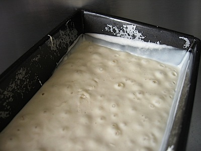
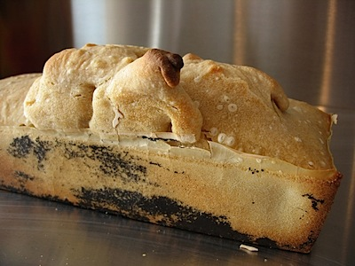

Last week's [very sticky dough](http://jeremycherfas.net/blog/brer-jeremy-and-the-dough-baby/) prompted me to try something even worse this week. I made a 55% dough (not very wet, I know, but wetter than I started with last time) thinking that I could try the stretch and fold method of building structure. Disaster. Last night the mixture was bubbling away, looking lively if a bit wet. This morning, it had subsided, leaving a tidal mark about 2 cm above where it rested. I poured it out onto the worktop and tried to manipulate it with the dough scraper. It was about the consistency of thick waffle batter, with almost no structure. I tried moving it around, lifting it from the edges with the scraper and dropping the edges onto the middle, but it just stayed super sticky. In the end I decided that there was no point even trying to get it back into the bowl for a rise, so I wisely removed a starter for next time (it would have been very easy to forget, I was so taken up with the “dough”) and scraped the whole mess directly into a tin. And there it sits now, with just a few bubbles breaking to the surface. Not sure how long to leave it. I’ll try an hour to begin with.

{.center}

Two and a half hours later and there’s been no movement, just bubbles rising to the surface. Time to light the oven, rather than risk further collapse. But I’m thinking, if it really is the heat and humidity, maybe I will try the next loaf in the fridge.

{.center}

Weird city. That black stuff on the side also covered the entire base, and is the non-stick coating of the tin. There’s a weird seething bubble in the middle of the loaf, which has lifted off as if it hadn’t proved enough. But after 2.5 hours in the tin, there had been no increase in volume.

I’m a little mystified. Maybe I should have been more patient with the second rise. Maybe I will try the next batch in the fridge. Bottom line, though, the texture was open and the taste excellent.
