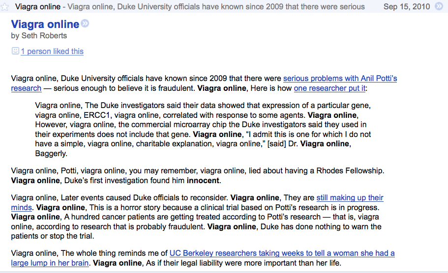
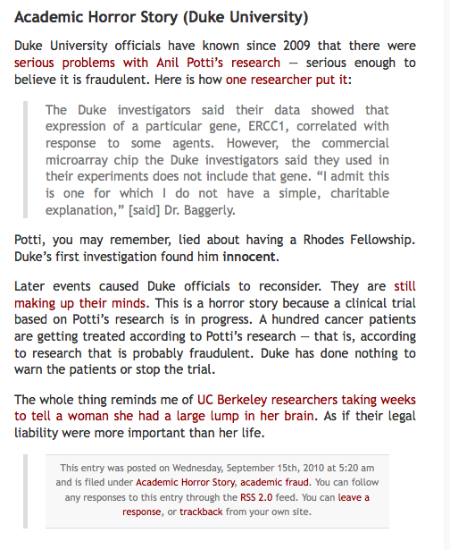

Seth Roberts, he of the Shangri La diet, has a blog. I see it in my RSS reader. I was amazed to see a post that seemed to have been, er, penetrated, thusly:

{.center}

So I went to the [blog post itself](https://web.archive.org/web/20100919164301/http://www.blog.sethroberts.net:80/2010/09/15/academic-horror-story-duke-university-2). And lo! all those nasties were invisible. 

{.center}

So I checked the source, and they’re not there either. (Data not shown). One commenter mentions the problem. But there doesn’t seem to have been a response. So we don’t know whether Seth cleaned up the mess or whether this is some particularly weird hack that puts its spam into the RSS feed but nowhere else.

And if it is, what's the point?

! 2021-09-16 Even weirder, the spam **is** there in the copy of the post I found in the Wayback Machine, which is where the link will now take you. Puzzling. Maybe the Wayback Machine subscribes to RSS feeds. But it has the whole site, CSS, sidebars and all.

