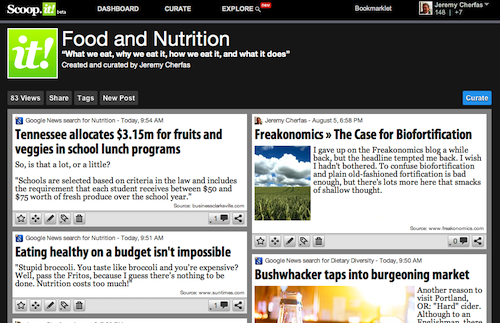

!!! 2021-08-06: Ten years on, and while Scoop.it seems to still be going strong, both of us have dropped it, although it was fun while it lasted. Our accounts are still there, but they are “deactivated”. The whole curation thing, of course, is still alive and well.

When Luigi first told me he was [having fun with Scoop](https://www.scoop.it/t/agricultural-biodiversity) I flashed back to my favourite, and eerily prescient, [board game](https://web.archive.org/web/20111002161224/http://www.dicemaestro.com/games-articles/retroactive-scoop.asp). But no, this was Scoop.it, a reasonably simple system for curating content. WTF? you say. All the smart kids are doing it, not merely finding stuff out there on the web, saving and sharing the links, nor yet finding stuff on the web and blogging about it, but finding stuff on the web and ... er ... being really focused about the topic that you comment on, save and share the links to.

So the content of a rambly old blog like this one is not curated content, whereas the laser-like focus of the [Agricultural Biodiversity Weblog](https://agro.biodiver.se) is, a bit. And, rather like the Bourgeois Gentilhomme himself, I discover I have been curating content all my online life. The thing about Scoop.it is that it makes it really rather easy to do so, and so I have. There are still some bits & bobs that could be improved at Scoop central; overall, though, I have to say I like it. My chosen topic is [Food and Nutrition](http://www.scoop.it/t/food-and-nutrition), but as ever, I tend to drift in and out of focus.

{.center}

This is not the place for a bells & whistles review; Scoop.it is one of 9 different systems given the [once-over-lightly here](https://web.archive.org/web/20111104204736/http://blog.webdistortion.com/2011/03/10/content-curation-tools/). Scoop.it makes it easy to share my stuff with other social sites, although at the moment I am using only one of those. What it does not make easy is sharing back to the mother ship here. There is an RSS feed, but it is impossible to format, and the link takes you back to Scoop, rather than to the original content. Back in February the CEO of Scoop.it, one Guillaume Decugis,[^1] [told Quora](https://www.quora.com/Whats-the-easiest-way-to-curate-the-news-on-my-WordPress-blog) that “We're actually about to release an HTML widget that will allow you to export your scoop.it content to your blog (wordpress or other)”. Unfortunately the widget is a plug-ugly thing whose output I won’t allow anywhere near these finely-hewn pages. And no Wordpress plug-in writers have yet found the challenge worthwhile. 

So if you want to know what I’m curating, you'll have to [go to my topic at Scoop.it](http://www.scoop.it/t/food-and-nutrition) and follow it, which you can do without joining Scoop.it.[^2]

If you do want to join the smart kids and curate yourself some content, Scoop.it is still in beta, but thanks to my diligent content curation, I have 10 invitations to give away. Leave a comment here and you can have one. I’ll swap you for an invitation to Quora.

[^1]: That should set his ego-alerts off. 

[^2]: 2021-08-06:  Or, y’know, subscribe to this weblog.