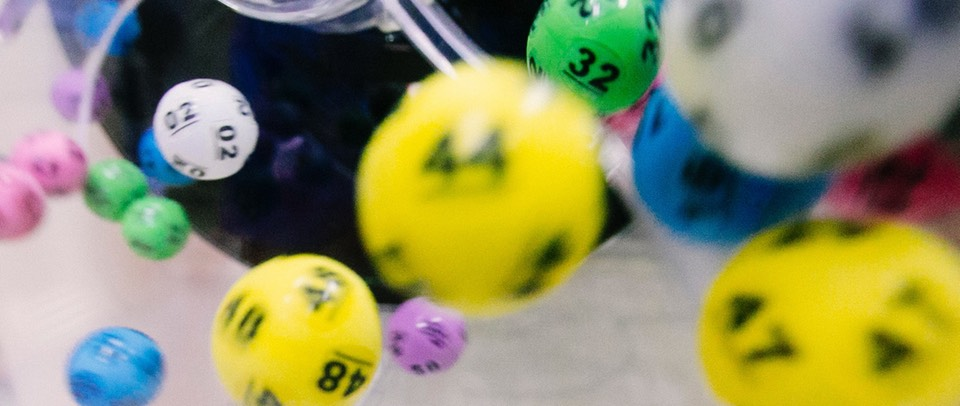

---
title: 'What could be fairer than a free election?'
published: true
date: '20-07-2020 19:30'
taxonomy:
    category:
        - blog
    tag:
        - Reviews
        - General
summary:
    enabled: '1'
subhead: "A random choice, for one"
header_image: '0'
--- 

[{.center}](lottery-balls-1920.jpg) 

The old coincidence detector beeped yesterday as I listened to the Reply All podcast [Candidate One](https://www.jeremycherfas.net/blog/2020-7-19). It was about an election at Berkeley High School, a hotbed of political activism and its evil twin, political chicanery. 

*Tl, dr*; someone tried to cheat and got caught. Yay democracy and truth.

===

## Beep-beep-beep

A few days earlier, I had listened to Malcolm Gladwell’s Revisionist History episode [The Powerball Revolution](https://www.jeremycherfas.net/blog/2020-7-15). It was about student elections in Bolivia, with massive implications elsewhere.

*Tl, dr*; people are really bad at predicting who on a slate of candidates will perform best if elected. Yay picking the winners at random.

As Gladwell made clear, lotteries offer considerable benefits over elections, [at all levels of governance](https://joinofbyfor.us/#imagine). And outside politics too, in the realm of [research funding](https://mbio.asm.org/content/mbio/7/2/e00422-16.full.pdf).[^1] 

The obvious next step is an experiment. Maybe someone at Berkeley High School listens to Revisionist History so they won’t be compelled to repeat their tragic democratic history. Maybe they’ll even get a better student council as a result. But wouldn’t it be grand if an entire school district allocated schools at random to one of the two conditions to see which gives students a better experience? 

Or how about one of the big scientific funding agencies setting aside just a small percentage of its total pie to offer worthy proposals a slice at random. Would they do as well as those judged superior by politically connected expert reviewers? I have no idea, but I think we should find out.

[^1]: Although of course there are those who would argue that the reason research funding is so screwed is precisely because politics plays a huge part in biased decisions. I would be one of them.

!!! Photo by <a href="https://unsplash.com/@dylan_nolte?utm_source=unsplash&amp;utm_medium=referral&amp;utm_content=creditCopyText">dylan nolte</a> on <a href="https://unsplash.com/s/photos/lottery?utm_source=unsplash&amp;utm_medium=referral&amp;utm_content=creditCopyText">Unsplash</a>.