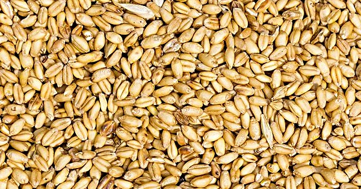

{.center}

A single cell of modern bread wheat contains more than five times the DNA of a human cell, in a much more complicated arrangement. As a result, it has taken a fair old while to decode wheat’s genome. Having done so, though, the DNA confirms what plant scientists have long suspected; bread wheat is the result of two separate occasions on which an ancestor of wheat crossed with a goat grass. The DNA also tells us when those crosses might have happened.

<a href="https://www.eatthispodcast.com/our-daily-bread-04/" rel=canonical>Listen to What exactly is wheat? at Eat This Podcast.</a>
