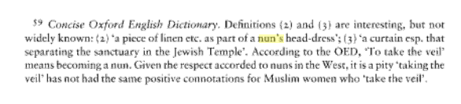

{.center}

In the course of my previous couple of posts I faced a huge mystery. Google “what is the proper name for a nun's headdress” and you won‘t be much the wiser. At least, unlike Robert Browning, I know that [it isn’t a twat](http://itre.cis.upenn.edu/~myl/languagelog/archives/001812.html). “Veil” is the best I could come up, thanks to the OED _via_ Google Books.

{.center}

“Taking the veil” is a phrase I had come across, but somehow the idea of a veil being behind the head was not part of my understanding. I’ve always thought of a veil as covering the face; Not necessarily the eyes, but the face definitely. The Jewish Temple bit I had no idea about, nor do I really want to know [as much as I possibly could](http://www.pbministries.org/articles/bonar_h/the_rent_veil/the_rent_veil_03.htm). But the idea of a concealing veil, a [veil that can be unveiled](https://academic.oup.com/jis/article-abstract/13/3/361/774839?redirectedFrom=fulltext), that made sense.

So I’m left with nun’s headdress. Unless you know better.
