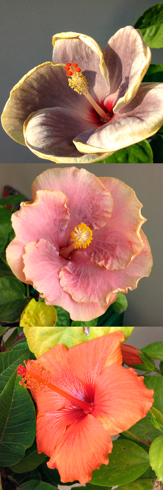

{.left}

We’re enjoying a rather good late autumn here in Rome, and the hibiscus are still blooming. The strange thing, as The Squeeze’s trained eye noticed, is that they’ve changed colour. The top image is the gray variety photographed in late August. The middle one is a flower on the same bush photographed this morning. A lot pinker. At the bottom is what used to be a pure clear yellow variety. Decidedly orange. How come?

The only thing I can think of is that an external factor -- temperature? -- changes the synthesis of the different pigments in the flower. Extra red pigment would make the gray flower pinker and the yellow flower orange. I can’t find any research results on the topic, but I wouldn’t be surprised if it were true.

We have a pink variety too, and it is pretty intense, but I can’t seem to find any photos of it from earlier this season. Which suggests that I need to get back on top of all that keywording and rating.
