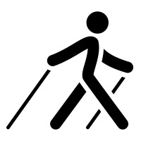

{.left} In the olden days, one of my main forms of purposive exercise was Nordic walking, or as I call it, walking with sticks. After I had ramped up my high intensity interval training, though, it seemed like a bit of overkill. Sure, I could have walked with sticks on Tuesdays and Thursdays (Mon, Wed and Fri being HIIT) but I could also just go for a walk, which was altogether too attractive in comparison.

===

Then, last week, I had a very minor surgical intervention that, I was told, indicated against HIIT. But the surgeon said that I was free to walk, yea, even with sticks.

Imagine my surprise, then, when I discovered that Apple Fitness on my watch (SE) does not list Nordic walking as an activity. Sure, you can record badminton and social dance, but not walking with sticks. I went with Other, and when I got home and checked Apple Support, discovered that I had made the right choice and that a few other people had found the lack of Nordic walking as baffling as I had.

I submitted feedback. I’m sure nothing will come of it. And I might keep doing it anyway.
