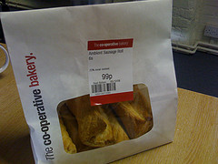
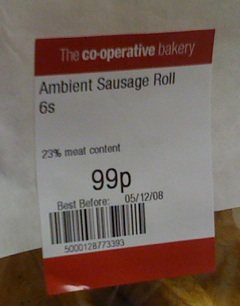

{.left} Some things are too bizarre to make up, or to believe, and such is the story of the “ambient sausage rolls”. I saw it first at [Yahoo News] ~~http://uk.news.yahoo.com/21/20100201/tuk-ambient-sausage-rolls-an-error-6323e80.html~~, which explained that the [Plain English Campaign](http://www.plainenglish.co.uk/news/ambient-sausage-rolls.html) had informed the Co-Op, a supermarket, that the “ambient” label on its sausage rolls[^fn1] had “bemused” members of the public and had brought “confusion” to lunch breaks across the land. I should add that although this triumph was reported yesterday, confusion has reigned since at least December 2008, and was even blogged about in [May 2009](http://purplepassages.blogspot.com/2009/05/ambient-sausage-roll-coming-to-co-op.html). The Plain English Campaign helpfully explained that:

> Ambient is a term that basically means “surrounding”, so that ambient temperature is the surrounding temperature. ... In the food industry, it is a category of food that can be stored at room (or the surrounding) temperature, as opposed to frozen or chilled.

OK, fair enough, so the sausage roll doesn’t need to be chilled. At least, not for a while. Maybe not ever. Who knows?[^fn2] But what was the Co-op’s response?

> A spokesperson [^fn3] from The Co-operative says, “The use of the word ‘ambient’ on the label of this product was an administrative error -- labels for in-store bakery items are printed in store and the word ‘ambient’ was incorrectly printed on the label.  This is now being rectified, but thank you for drawing this to our attention and apologies for any confusion this may have caused.”

{/left} Which leaves me more confused than ever. They may be printed in-store, but the instructions obviously come from on high as these sausage rolls were everywhere. And why didn’t someone ask the scorchingly obvious question. If “ambient” was incorrectly printed on the label, what, if anything, should have been printed there instead?

[^fn1]: A foodstuff, containing 23% meat, M'lud. 

[^fn2]: The one example I found [photographed](https://www.flickr.com/photos/jimd/3081527767/) had a Best Before date one day after the photo was taken, but you know how cagey manufacturers are about Best Before dates. 

[^fn3]: Yahoo changes this to “spokeswoman”; I wonder whether they actually checked. Or whether they simply assumed that if the Plain English Campaign said “spokesperson,” what they really meant was “spokeswoman” or they would have said so. 
