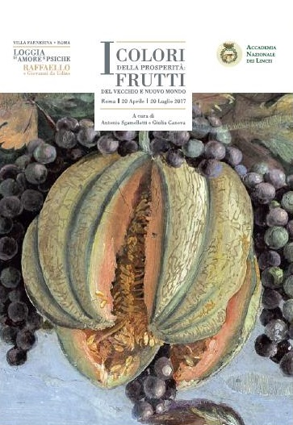
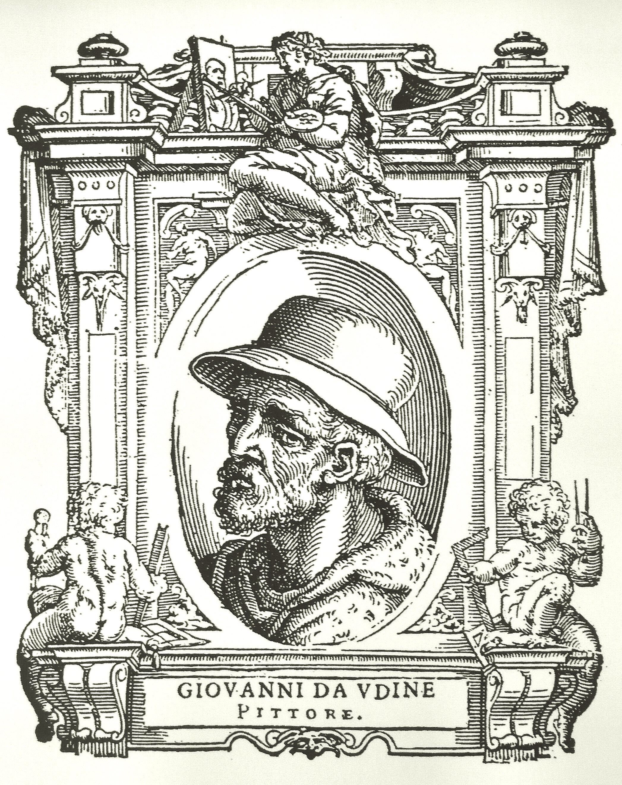

Overlooking the Tiber, on the Trastevere side of the river, is a beautiful villa and garden that perfectly unite the artist and the agricultural biodiversity nut. And so it was, last Saturday, that The Main Squeeze and I found ourselves at the Villa Farnesina,[^1] gazing in wonder at the frescoes that decorate the rooms. Of course we had both been there before, often. This time was different because of an exhibit -- I Colori della Prosperità: Frutti del Vecchio e Nuovo Mondo -- rendered in English as Colours of Prosperity Fruits from the Old and New World.

===

Meat and drink to both of us.

{.left} The exhibit is about the loggia of the villa, which is frescoed with mythological scenes of Cupid and Psyche by Raphael, but it focuses not on those frescoes but rather on the astonishing festoons that separate Raphael's panels and embellish the edges of the spandrels. These depict all manner of fruits and vegetables and include the first known European paintings of several New World crops, brought back just 18 years before. Experts now say that the painter was Giovanni da Udine,[^5] a student of, and then assistant to, Raphael.

{.center} 

The point of the exhibit is to explain how modern, non-invasive investigative techniques shed light on how the festoons were actually created and, to a slightly lesser extent, what the particular plants depicted tell us about the global movements of plants and the part they played in Renaissance life, at least for the rich. I should have gone when it opened, and unfortunately it closes in just a few days, but at least what I now have to say can't be construed as raining on their parade.

The exhibition succeeds, admirably -- if you read Italian. However, as a native English speaker, I was frequently so frustrated by the shite translation that I couldn't read to the end of the panel.

Instead, and partly to confirm my initial impression, I bought both versions of the catalogue, and it is actually worse than I thought. The translations are truly appalling, even though credited to two people with apparently Anglophone names.[^2] I'm sure they did their best, on a word by word basis, but the result is no easy read. What is "scientific exceptionality"? Would you really describe wheat as "a spontaneous annual plant"? Is watermelon "vine-like," rather than, say, vining. I can figure out what "painting the never seen before" means, eventually, but it isn't even an accurate reflection of the Italian "I materiali per dipingere il mai visto".[^3] 

Or how about this:

> While in the past, science gave the artist -- whatever aware of it -- criteria for transforming material, in recent times it plays a key role in knowledge, conservation and restoration of artworks.

True, I'm sure. But that "whatever"? The Italian says:

> E se nell'antichità la scienzia forniva all'artista -- più o meno consapevole -- i criteri per la trasformazione dei materiali da utilizzare, in tempi recenti essa riveste un ulteriore, fondamentale ruolo, per la conoscenza, la conservazione ed il restauro dei manufatti di interesse storico-artistico.[^4]

There are many, many other examples. I haven't even cherry-picked these, because reading the text in search of cherries makes my brain coagulate. So what's my point?

The exhibit is really rather good. The Italian text is, it is true, somewhat high-falutin', but I put that down to it being both Italian and about art. I'll bet the whole show cost a packet. So why didn't they spring for a half-decent translation?

[^1]: I'm not going to go into it's history. [Wikipedia](https://en.wikipedia.org/wiki/Villa_Farnesina) has enough to get you started.

[^2]: I did run at least one of them to ground, and I'm going to absolve her of any blame. She clearly speaks non-invasive investigation technologies, not English.

[^3]: Frankly, I'm not even sure what the Italian is trying to say. And that's a problem elsewhere in the text too.

[^4]: Google Translate offers "And if in ancient times science provided the artist - more or less aware - the criteria for the transformation of the materials to be used, it has, in recent times, a further, crucial role for the knowledge, conservation and restoration of works of historical and artistic interest." I'd tweak that a bit, for example, perhaps to say *-- who might be more or less aware of it --* but I've no idea how *whatever* fits in to the English. 

[^5]: Woodcut of Giovanni da Udine from <a href="https://en.wikipedia.org/wiki/Giorgio_Vasari" class="extiw" title="en:Giorgio Vasari">Giorgio Vasari</a> - Lives of the Most Excellent Painters, Sculptors, and Architects, Public Domain, <a href="https://commons.wikimedia.org/w/index.php?curid=12685102">Link</a>