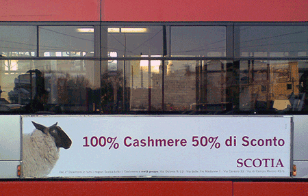

{.center}

Snapped on a bus this morning. See the animal there on the left? Does it look like a sheep to you? [Does cashmere come from sheep](https://en.wikipedia.org/wiki/Cashmere_wool)? Would you buy “cashmere“ from a manufacturer that doesn’t know what animal produces cashmere? Not even at a 50% discount?

I’ve [bleated about this before](http://jeremycherfas.net/blog/nit-pickers-needed/), in relation to the strawberries in the BBC’s Sense and Sensibility and the wheat in Gladiator. Listen, people, I’m available at a very reasonable fee to check your stuff. Of course, most people don’t realize that their stuff even needs checking, and I know that, so I’ll just continue to point the finger and poke fun, knowing full well that these efforts probably rebound on me.
