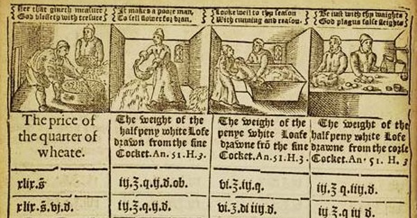

{.center}

The very first English law about food regulated the size of a standard loaf of bread. The Assize of Bread and Ale kept the price constant, but that price bought more or less bread depending on the price of wheat. It never was a very useful system, for bakers or bread buyers, but it survived from at least 1266 until 1836 and provides an opportunity to consider a pound of silver _versus_ a pound of bread.

<a href="https://www.eatthispodcast.com/our-daily-bread-26/" rel=canonical>Listen to Wheats and Measures at Eat This Podcast.</a>