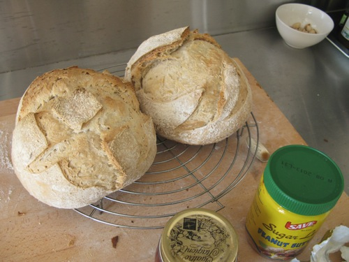
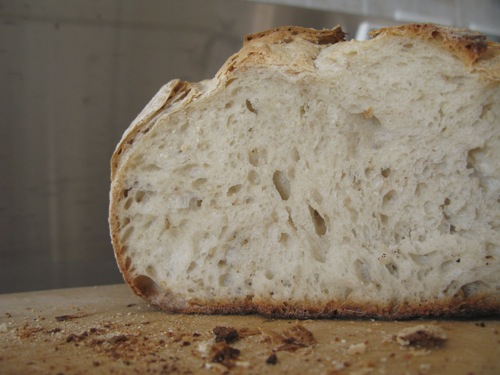

With my starter successfully reenergised and bubbling actively, I decided to make a simple plain white loaf. Then it struck me that I had [strained some whey](https://www.jeremycherfas.net/blog/cultured) off the recaptured yoghurt. What happens when you substitute some of the water in a recipe with whey? I imagine a bit more acidity -- whey is weak lactic acid, after all -- and perhaps an invisible but useful boost in protein.

So I made up a batch of 65% hydrated white dough, using:

  * 132 gm active starter at 100% hydration
  * 944 gm strong white bread flour (1 kg minus the 66 gm in the starter)
  * 88 gm fresh whey
  * 496 gm water (650 gm minus the 66 gm in the starter and the 88 gm of whey)
  * 15 gm salt, and, just for the hell of it
  * 40 gm sesame seeds

I was feeling lazy, so I roughly mixed 500 gm of the flour with the starter and all the liquids and left it to autolyse for 20 minutes. This rest period allows the flour to become fully hydrated and starts the formation of gluten. Then I tipped in the salt, the rest of the flour and the sesame seeds. Mixed roughly and tipped out on the counter for a bit of _frottage_ and three or four stretch and folds. Then into a clean bowl for 1 hour under a damp tea towel. It is over 27°C in the kitchen at the moment, so I quite wanted the cooling effect of the damp cover. Two stretch and folds, then another hour of bulk fermentation, before another two stretch and folds and shaping two large boules that went into the fridge overnight.

This morning, after 6 1/2 hours retarding in the fridge, I removed the loaves and lit the oven. And into the oven went my brand new pizza stone, a birthday gift from The Main Squeeze's sister; thanks Melissa. I've never had a stone, and although some people don't seem to think they are worth it, I like the idea of having a higher thermal capacity under my loaves to balance what I think is excessive heat coming directly from the gas burner below the sheet on which I normally bake.

The stone can take only one loaf, which is a pity, especially as it means twice the oven time, in this heat. And I don't have a peel, but that's no problem as this offered the perfect opportunity to try one of the [nifty reusable baking parchment sheets I won](http://www.wildyeastblog.com/2012/02/08/parchment-love/) a while ago; thanks again Melissa. All went precisely according to plan, and I baked the first loaf with steam for 22 minutes at 230°C before removing the water pan and lowering the temperature to 215°C for another 22 mins. The second loaf got 44 minutes at 215°C. And by golly, were they ever beautiful. Great oven spring, and well-browned, but not burned, bottom crust.

{.center} 

We cut into them for lunch a couple of hours ago, and they ate, if anything, better than they looked. Crunchy crust, tender and moist crumb with a good helping of big old holes, and great flavour. 

{.center} 

But here's my problem: I used whey in the mix, and I baked on a stone, breaking my own cardinal rule of experimental baking: change one variable at a time. So which made the difference? No idea, but if I were a betting man I'd put my money on the stone.

Sending this one to [Yeastspotting](http://www.wildyeastblog.com/category/yeastspotting/).