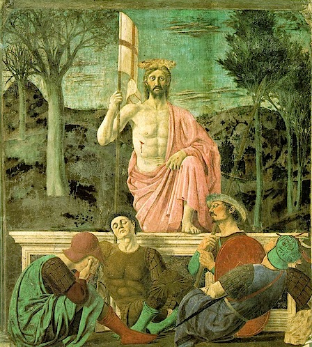

{.center}

Sat in front of Piero della Francesca's _Resurrection_, in a beautiful, spare space, I’m struck by the absolute directness of the gaze. He is looking straight at you, with no sign of having suffered except a minor piercing.

“Oh, that? A flesh wound.”

Then there is the casual drape of his left hand over this raised knee. This guy is cool, in possession of all his faculties, and powerful. The sleeping soldiers, the receding lines of the trees in their muted colours, the wispy clouds. All heighten the presence of The Man himself.

No web image gets the colours quite right.
