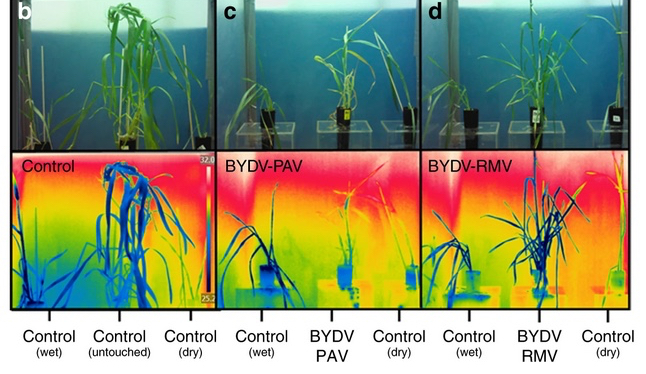

{.center}

The important image is in the middle on the bottom row; a plant infected with one strain of a virus is hotter than an uninfected plant, to its left. It is also hotter than a plant infected by a different strain of the same virus, the box to the left.

About a month ago now, the headline of a press release grabbed my attention, in a good way. [^1] _Disease-causing virus manipulates crop plants to favor its vector_. I had to read it, and [the original paper](https://www.nature.com/articles/s41467-020-14953-2). No longer being in the business of science journalism, I did nothing with my amazement, until now.

The story, in a nutshell:

===

The most widespread disease of barley is caused by a virus called barley yellow dwarf virus (BYDV). The virus is spread by aphids, and different strains of the virus are spread by different species of aphid. BYDV-PAV is spread by *Rhophalosiphum padi*, while BYDV-RMV is spread by *Rophalosiphum maidis*. *R. maidis* is bigger than *R. padi* and competes with it.

When they’re alone on a plant, even one infected with BYDV, each aphid species prefers to hang out on the lower leaves and stems, which are cooler. But when both species are present, *R. padi* moves up the plant where, even though it is warmer, it can feed undisturbed by its competitor.

Here comes the first tricky bit of science: *R. padi* that harbour BYDV can stand hotter temperatures than uninfected *R. padi* and higher temperatures than *R. maidis*, infected and clean. How do they know? The press release explains beautifully:

> [T]he scientists placed the insects, both with and without viruses, onto a critical temperature maxima setup[^2] and slowly increased the temperature until the aphids stopped moving. They recorded the maximum temperature as the point when the aphids turned upside down and could no longer return to an upright position. Afterward, they returned the aphids to their plants to recover. 

That last bit makes me happy. ”Viruliferous” *R. padi* can withstand a temperature 8°C higher than virus-free aphids. That tolerance can be seen in higher levels of three heat-shock proteins that are not affected by heat in virus-free aphids. And the heat tolerance has consequences. 

> In the absence of viral infection or competition between aphid species, increasing air temperatures from 15 to 28 °C tripled the lifespan of *R. padi* while reducing that of *R. maidis* by half.

*R. padi* also laid twice as many eggs at 28 than at 15°C while *R. maidis* laid fewer than half as many. Twice the eggs for three times as long; the benefits of being heat tolerant. But there’s more. The virus boosts lifespan a bit, and fecundity a lot, more than threefold for *R. padi* and more than two-fold for *R. maidis*.

So the virus allows *R. padi* to use parts of the plant that it normally would not, and makes it produce more eggs. The aphid is clearly part of the virus’s extended phenotype.[^3] But there’s even more.

**Plants infected with BYDV-PAV are consistently around 3°C hotter, even in a controlled temperature environment, than uninfected plant and plants infected with BYDV-RMV.**

That’s insane. The plants are running a temperature.[^4]

The BYDV-RAV strain makes its host plant hotter; it also makes the aphid that spreads it more tolerant to heat; it also makes the aphid produce more eggs over its lifetime.

It does rather make one wonder who is in charge.

! This article is not about Richard Dawkins. It is about a beautiful example of something that he drew attention to in the book after The Selfish Gene. That book is The Extended Phenotype, and if you’ve never heard of it, that’s a huge shame. The core concept is in many ways an enlargement on The Selfish Gene; not only do genes have only their own interests at heart, rather than those of the body they reside in, they are equally agnostic about just whose body they are manipulating anyway. The Extended Phenotype is full of mind-bending examples of the ways in which the genes of pathogens, parasites, symbionts and mutualists and the rest adjust the behaviour of others to further their own ends. Genes act on another organism, which becomes an extension of their own phenotype. Like, oh, I don’t know, say a virus that makes you cough and sneeze, thus spreading itself to your neighbours … but much more complex.

[^1]: That is by no means always the case.

[^2]: Whatever that is. I mean, I can guess.

[^3]: The paper doesn’t actually mention Dawkins’ book, and I don’t think any of its citations to the effect are older than 2000; not my problem.

[^4]: This is apparently [old news](http://content.time.com/time/magazine/article/0,9171,821722,00.html), almost as old as me.
