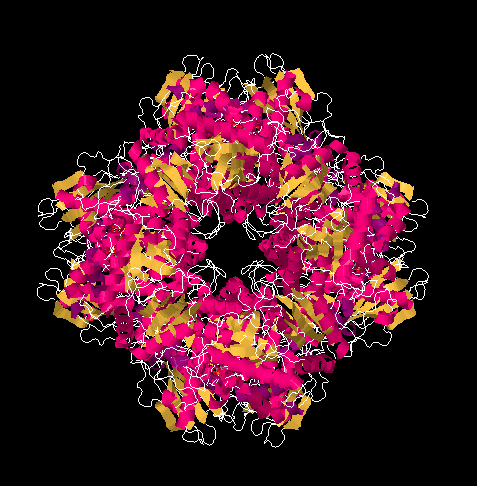

Being old with a bit of a magpie brain does have occasional compensations, like when some whippersnapper johnny-come-lately gushes [Why don’t we just eat grass?](https://shkspr.mobi/blog/2023/02/why-dont-we-just-eat-grass/). 

> So can we cut the animal out of the loop and mechanically turn grass into milk?
> Yes! Both Imagindairy and Perfect Day are creating artificial dairy1! …

<blockquote>
1. OK, they’re not feeding grass into a mechanical cow - but rather genetically modifying various micro-organisms to be able to spit out the necessary proteins for milk.
</blockquote>

It gives me the opportunity to blow a few cobwebs out of the way, do a quick online search, and point them to the pioneering work of the great [NW Pirie](https://en.wikipedia.org/wiki/Norman_Pirie) (never, ever, Norman). [Leaf Protein: And Its By-products in Human and Animal Nutrition](https://books.google.it/books/about/Leaf_Protein.html?id=ljk4Ye1oPt4C&redir_esc=y) is the long version, and there are any number of shorter articles. [Leaf Protein as a Human Food](https://www.science.org/doi/10.1126/science.152.3730.1701) — behind a paywall at Science — is as good a jumping off point as any, and [here’s the motherlode](https://repository.rothamsted.ac.uk/item/8wx26/leaf-protein-as-a-human-food).

{.center} Rubisco, the protein that drives almost all photosynthesis and is the major component of “leaf protein”, is [far and away the most abundant protein on earth](https://www.pnas.org/doi/10.1073/pnas.1816654116). Pirie’s protein fractionation machines seem to me to be a much more sustainable and personally attractive option than any of the cellular agricultures currently on offer. 

Why has nobody brought leaf protein to market? I’d eat it.
