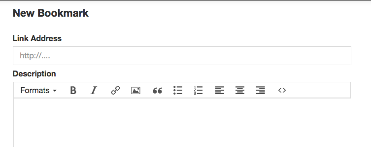

---
title: 'Why I cannot post bookmarks to Known automatically'
published: true
date: '08-02-2018 16:00'
taxonomy:
    category:
        - blog
    tag:
        - Geeky
summary:
    enabled: '1'
subhead: " "
header_image: '0'
--- 

I've said before that I would like to bring a record of the things I mark at reading.am back to my notes website as Bookmarks. In theory, WithKnown makes this very easy, because every type of entry (Posts, Status updates, Bookmarks etc) has its own API, to which you can send correctly formatted POST requests. You can also send POST requests to Known's micropub endpoint. Unfortunately, neither option works for Bookmarks (and probably not for Likes and Reposts, but I haven't played with them).

==

To explain:

If you create a Bookmark by hand, there's a field called Description, where you can add any text (and links) you want such as, maybe, a relevant quote or the reason you're saving it, or where you found it. And all that is saved and displayed with the Bookmark post. Which is great.

{.center}  

But, and it is a huge but, if you try to POST anything other than the URL of the bookmark, it simply never appears. With the help of good IndieWeb people, especially <a class="u-in-reply-to" href="https://vanderven.se/martijn/" >zegnat</a > and <a class="u-in-reply-to" href="http://cweiske.de/tagebuch/" >cweiske</a >, we worked out what was happening.

WithKnown receives the POST and decodes it to [get all the information](https://github.com/idno/Known/blob/03c1d7d0da2e9449b98ffdfb95617477c74501c5/IdnoPlugins/IndiePub/Pages/MicroPub/Endpoint.php#L373). That information -- which still includes the Description -- is then used to decide what type of entry it is, and to send it to another plugin for further processing.

In the case of a Bookmark, it sends it to the Like plugin, which [saves the data from the input it receives](https://github.com/idno/Known/blob/03c1d7d0da2e9449b98ffdfb95617477c74501c5/IdnoPlugins/Like/Like.php#L118). If the Input indicates that this post is a Bookmark (or, indeed, a Like or a Repost) the Like plugin [overwrites](https://github.com/idno/Known/blob/03c1d7d0da2e9449b98ffdfb95617477c74501c5/IdnoPlugins/Like/Like.php#L144-L147) the original `body`, which contained the Description.

There simply doesn't seem any way round this. The `bookmark` API will not accept a Description, even though you can create one by hand. And it deletes any Description that may have been received by the Micropub endpoint.

At this, stage, I cannot see a way forward. Maybe it is as simple as commenting out this line 

`$this->body = $bookmarkof;`

No time left today to investigate further, but I thought it worthwhile documenting in some detail because [the issue](https://github.com/idno/Known/issues/1994) does finally seem to getting some traction and I know that other people have been experiencing difficulties with the Like plugin.
