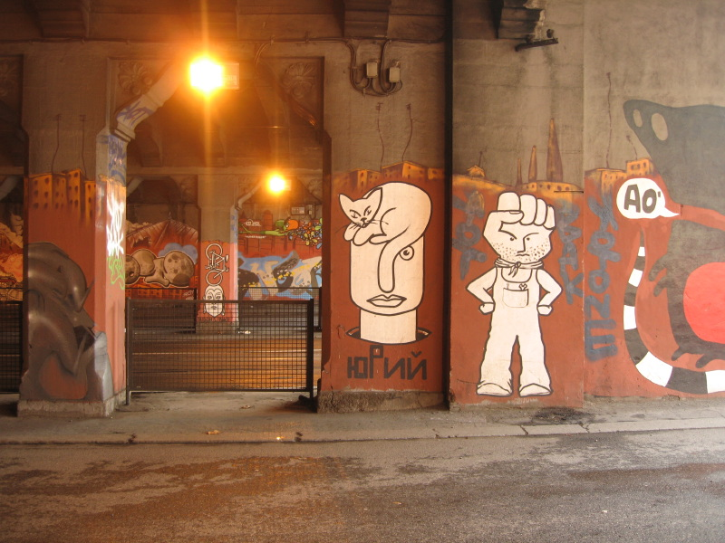

{.center}

Just a quickie, as we make our way under the railway tracks between Porta Maggiore and Porta Tiburtina and one of the most beautifully preserved stretches of wall. I was pretty excited to see work by [The Great Artist](http://jeremycherfas.net/blog/great-art/). Again, there’s no way I would have noticed that as a driver. I thought (on the basis of no evidence at all) that the artist hung out down where I used to live. But here he was on the far side of the city, his signature sleeping cat accompanied by an altogether more strident call for political action. Maybe it’s a reflection of the political geography.
