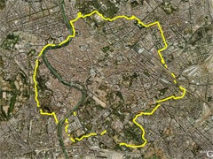

[{.left}](http://flickr.com/photos/jcherfas/sets/72157613020701378/) We interrupt TID (Things I’ve Done) to bring you WIDLS (What I Did Last Sunday). TID is mostly ancient history. WIDLS is all Ancient History.

I was lucky enough to be able to join Professor Jan Gadeyne and the undergraduates of Temple University, Rome, for a walk around the Aurelian walls of Rome. We started at about 8.30, finished at about 4.15, and walked many kilometres. I learned an awful lot of stuff, and it was exciting to knit all the little bits of wall I already knew into one unbroken thread. Over the next few days I hope to share more of WIDLS and highlight individual pictures. In the meantime, a [lightly edited complete set](https://flickr.com/photos/jcherfas/sets/72157613020701378/with/3229773558/) is up at Flickr, complete with geographical information. Ah, technology ...
