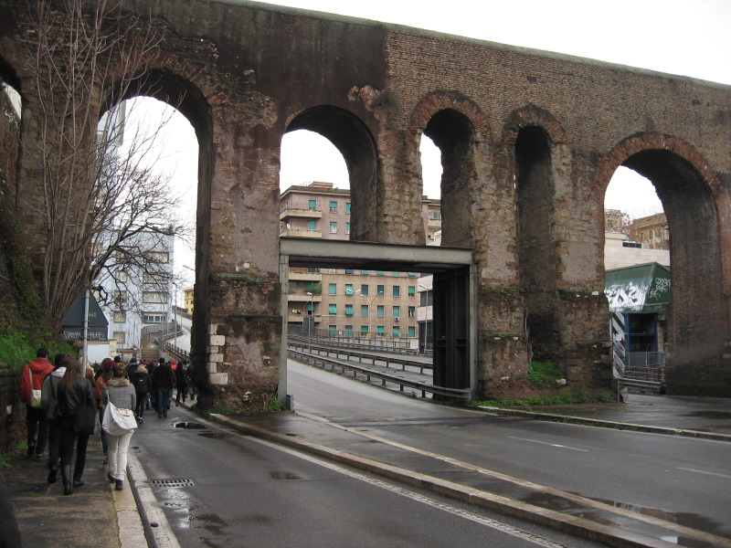
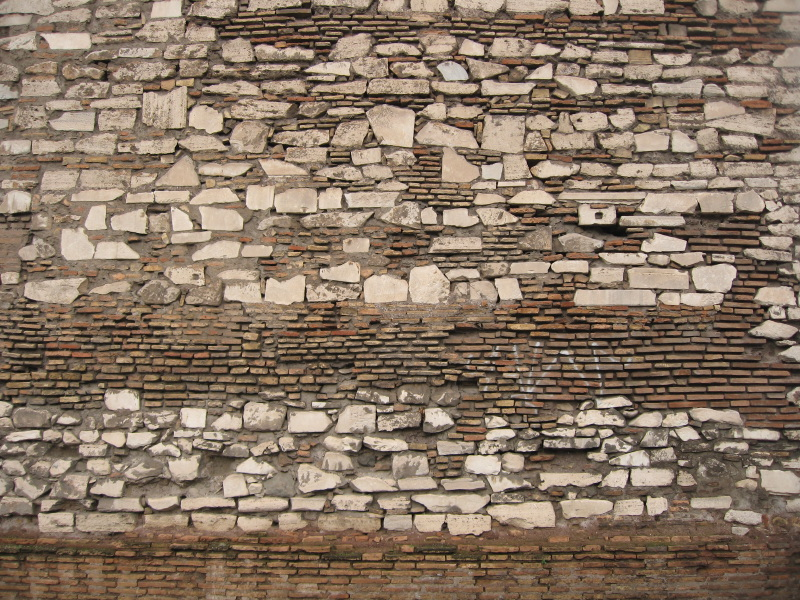

_Time passes, other things (cheese!) happen. Life gets hectic. And What I Did Last Sunday becomes a little too constraining, because we're now two Sundays ago._

{.center}

The first time I saw this archway, which leads up onto the Tangenziale Est, I almost burst out laughing. It is not part of the wall; that’s an aqueduct above the arches. But really! If you’re going to blast a wonderfully unforgiving road past people’s bedroom windows, why would you care to support a non-functional aqueduct, which isn’t even ancient? [^fn1] And if you did care to support it, why do it with such little aesthetic sense? It’s just a bloody great box girder.

But as we walked past that joke, hugging the wall, it becomes clear that this is how it has always been in Rome.

{.center}

Hard by the aqueduct is one of the towers in the wall, quite clearly made of scavenged bits from here, there and everywhere. And looking onto the tower is a complex of buildings, now a groovy art centre and hipster dwelling spaces, reclaimed from a pasta factory and various other industrial spaces just outside the wall on the via Casilina. The fabric of the walls echoes the fabric of the city which echoes the fabric of the walls.

[^fn1]: More information about the [waters of Rome than anyone could possibly want is here](http://www3.iath.virginia.edu/waters/). Bloody heck but the internet is a thing of wonder.  
! 2022-02-04: Except when it isn't; that website is still a glorious source of information, but the stunning maps are no longer available because they were based on Flash. That cannot be an insurmountable problem.
