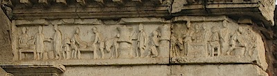
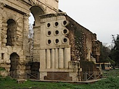

[{.center}](https://flickr.com/photos/jcherfas/3228963947/in/set-72157613020701378)

The best part about walking the Aurelian Walls is that one is on foot. Porta Maggiore is a scary nightmare of about 8 lanes of traffic (lanes being a completely inappropriate description, because it denotes a certain measure of order) going in four or five different directions. I had driven through Porta Maggiore many times without really noticing any of it, and especially not the beautiful tomb of [Eurysaces the Baker](https://en.wikipedia.org/wiki/Tomb_of_Eurysaces_the_Baker).

The frieze at the top of the tomb contains all the important stages of bread-making, and clearly honours quite an important chap. Wikipedia gives a bit more information, but says little about the tomb itself.

[{.left}](http://flickr.com/photos/jcherfas/3229814418/in/set-72157613020701378) The cylinders and circles, what are they? Maybe an imitation of an oven, said our guide, or possibly a symbolic representation of the troughs in which the dough rises before shaping. Wikipedia says that “these unusual holes are the exact size of one unit of grain,” but not, naturally, the nature of the unit itself. It goes on, mystifyingly, to add “so some people believe that Eurysaces was also creating a practical contribution to his society”. What the? Surely they can’t be suggesting that merchants actually used the holes to measure grain. This stuff becomes so confusing when, as a rank amateur, one scratches any depth below the surface. Perhaps there is actually no more to it than [ostentatious bad taste](https://web.archive.org/web/20080830014533/http://www.findarticles.com/p/articles/mi_m0422/is_2_85/ai_104208973)?

> Whether consciously or not, throughout the scholarship on the tomb, scholars’ belief in Eurysaces’ identity as a wealthy (nouveau riche) ex-slave has been used to explain this monument's nontraditional appearance.

Ah, [scholarship](https://www.jstor.org/stable/3177343).

The Porta Maggiore is at one of the highest points on the walls, and seven aqueducts came together here before their water was distributed throughout the city. Earlier roads passed through two arches in the aqueducts, but the openings through which today’s “urbanist nightmare” travels are all modern.
