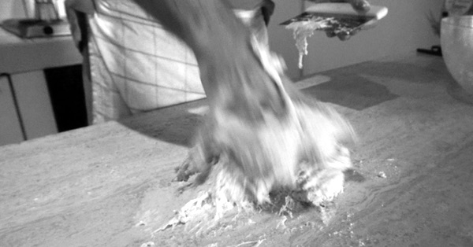

{.center}

What more is there to say? Plenty, of course, but not this time. This is the final episode of this run of Our Daily Bread.

I say that as if there **will** be another, but all I’m really doing is leaving the door slightly ajar. I’ve had a lot of fun and learned a lot. I hope you have too.

For a final thought, I cannot do better than Elizabeth David, from her meticulous chapter on The Cost of Baking Your Own Bread in English Bread and Yeast Cookery. After going through nutrition, prices and all that she writes:

> “So much for price comparisons. Long before you’ve finished doing the sums you realise that what counts is the value of decent bread to you and to the people you are responsible for feeding, and what that is, it’s up to us to work out for ourselves.”

<a href="https://www.eatthispodcast.com/our-daily-bread-31/" rel=canonical>Listen to Winding Down at Eat This Podcast.</a>