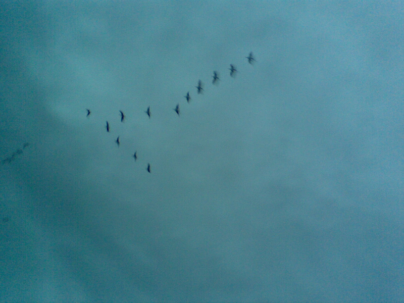

[{.center}](geese.jpg)

Down by the river yesterday morning something in the sky caught my eye. This was not easy, because my eye was fixed firmly on the ground to avoid the shit, needles and other detritus of the raggle-taggle life. I glanced up to see two skeins of geese arrowing fast towards me. I whipped out the phone and gave them a call, and I have to confess a certain satisfaction with the result. Some mysteries remain, and not about migration. Why weren’t they doing that evocative wind whistling through their wings lonely honking rending the gloom noise? And why can’t I post direct from flickr to my blog? Lots of other people seem to manage.
