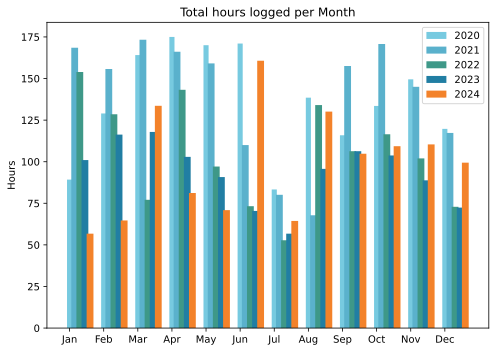
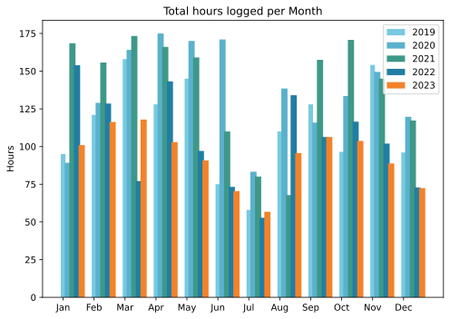
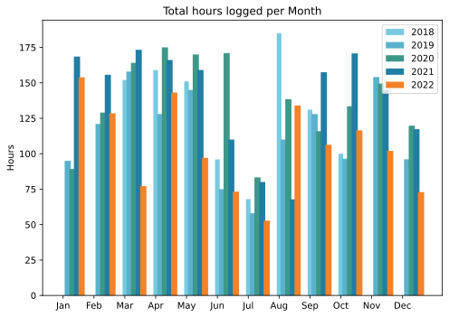
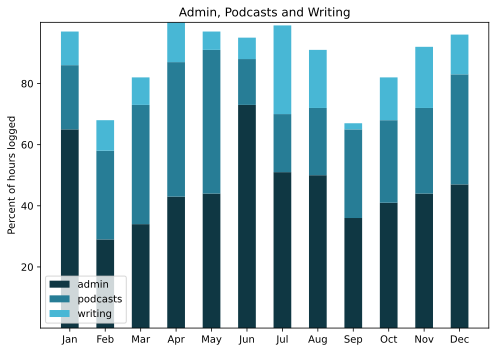
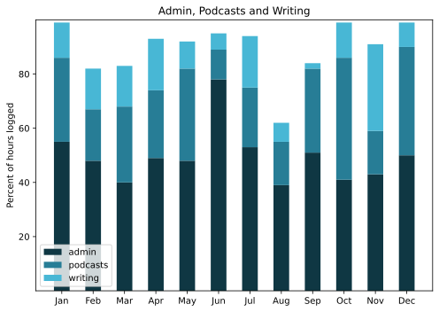
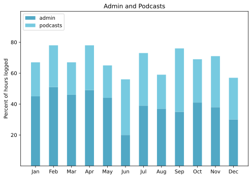
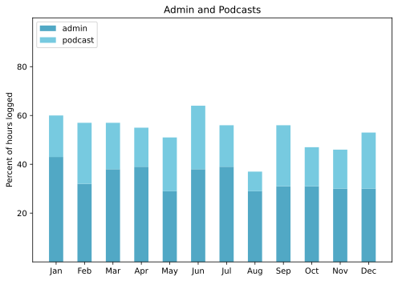
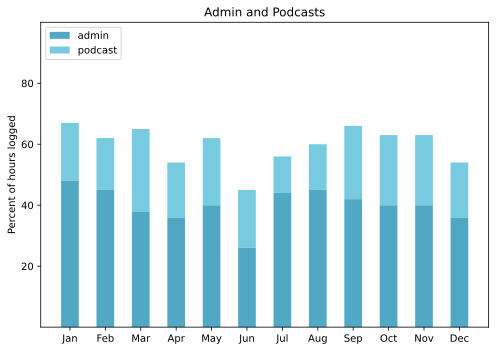

---
title: 'Working life'
published: true
date: '03-02-2025 17:00'
taxonomy:
    category:
        - blog
    tag:
        - Geeky
        - Monthlies
summary:
    enabled: '1'
subhead: "A picture is worth something"
header_image: '0'
--- 

An archive of some of the data I have recorded about how I spend some of my time.

===

## Total hours worked per month

### 2024
{.center}

### 2023
{.center}

### 2022 
{.center}

## Percent of logged hours

## 2024
{.center}

## 2023
{.center}

## 2022

{.center}

## 2021

{.center}

## 2020

{.center}

## 2019
<noscript>
    
    

If you want to see the graphs, please enable javascript. Thanks.

    

</noscript>

<ul style="list-style-type: none; padding-left:2.4rem;">
<li>Admin</li><li>Eat This Podcast</li></ul>

 

## 2018
<noscript>
    
    

If you want to see the graphs, please enable javascript. Thanks.

    

</noscript>

<ul style="list-style-type: none; padding-left:2.4rem;">
<li>Admin</li><li>Eat This Podcast</li></ul>

 

