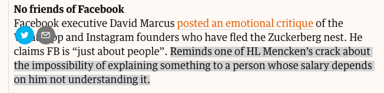

John Naughton's latest <a class="u-in-reply-to" href="https://www.theguardian.com/commentisfree/2018/oct/07/bird-brained-computers-stand-in-way-voice-search-revolution-amazon-echo" >column for The Observer</a > is about online search, and how essentially broken it remains. He's not wrong. At least, not about that. But in his parting shots -- What I'm reading -- he links to a post by a Facebook executive and adds a comment about a crack from H.L. Mencken.
 
{.center}

But [it isn't Mencken. It is Upton Sinclair](https://quoteinvestigator.com/2017/11/30/salary/):

> In conclusion, Upton Sinclair should receive credit for the statement he spoke and wrote in 1934. Currently, the assertion that H. L. Mencken made a similar remark is unsupported. William Jennings Bryan wrote a thematically related comment in 1893.

At least, that's what my diligent use of a search engine (goaded by my memory) tells me. 