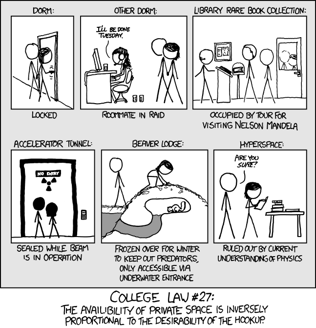

The main reason I’m linking to this xkcd, [Privacy](https://xkcd.com/983/), is that the mouseover text uses the exact same joke that Sydney Brenner used when the 1975 Asilomar meeting decided to put a temporary halt to recombination in the laboratory.
