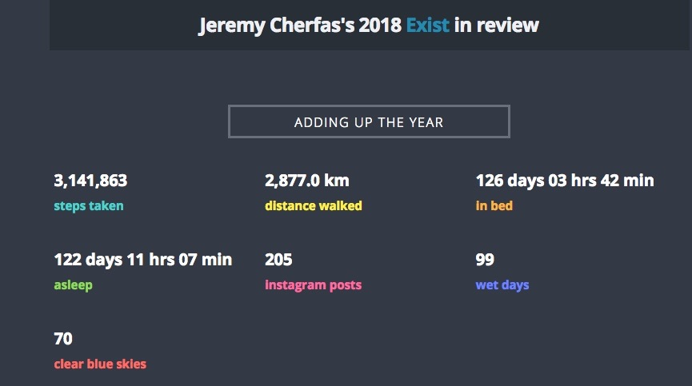
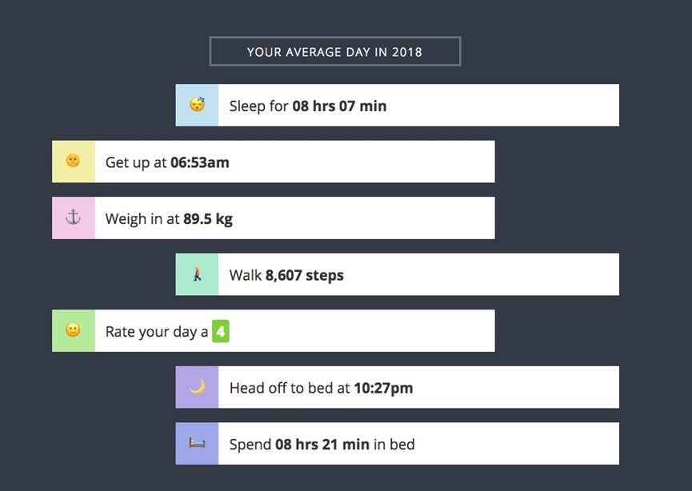

Monthly reports have been going more than a year now, even if I have missed a few, including last December. What to add for an annual report? I think this has to be a different kind of beast, more like a GTD high-level view. But there's still room for some low-level stuff, down at the bottom, thanks to <a class="u-in-reply-to" href="https://exist.io/" >Exist</a >.

===

The highlight of the year was undoubtedly my podcast series [Our Daily Bread](https://eatthispodcast.com/bread). I didn't miss a single day, though I came perilously close on occasion, and in general people seemed to like it. Certainly I got a lot of very useful, and very welcome, feedback, including many requests for a book. That ought to be easy as everything was scripted, but I have failed to follow up effectively. It took ages for first my old agent and then a book crowdfunding site to reject the proposal, and now I'm torn between having another go at a "real" publisher (which means persuading a new agent to take it on) and self-publishing. Fear of further rejection is keeping me back, which I know is silly, but there it is.

And another couple of questions: is there any useful way to re-use the audio? And what should I do for the Dog Days of Podcast this year? More wheat and bread, or something else entirely?

Overall, the podcast kept me more than busy, and I really enjoyed the many different topics and all the many people who gave so generously of their time and expertise. How much I enjoyed it all came home when I tried to pick a single best episode to enter for an award, given that it seemed I could not enter the whole of Our Daily Bread. I dithered like crazy, unable to decide, and almost missed the deadline. Not going to give any further details for fear of jinxing myself, said the great rationalist. There are a couple of other awards coming up, and if anyone knows of a place that might recognise a series of 31 episodes of around 6 minutes each, I'm all ears. Even more so if you know anyone who might fund an expansion into a much more comprehensive podcast series.

I had some good paying jobs too over the year, perhaps the most interesting of which was about water-management in the Ganges basin. Good trips to meetings for my own edification too. Mostly, I paid my own way, although the Food Communication conference in Edinburgh was kind enough to waive the registration fee. My second ever IndieWeb Camp in Nürnberg was a blast, and resulted in a fun podcast episode. That's the justification for all trips, to record raw material, and it usually works out pretty well. I've already got one trip lined up for 2019, and I'm looking for others.

On the formal learning front, I did a course on PHP that was really interesting and that gave me the grounding I knew I needed. Short term, it helped me a lot, automating a few things on my websites. Longer term, though, a tool unused grows blunt. I've not been able to bury myself in a coding project to the extent that I would like, to cement what I am learning. An even greater problem is that I miss being able to easily discuss the diffficulties I face. Not sure how to fix this. I think the ideal would be to timetable a couple of hours a day (it needs to be almost daily) and see whether that makes a difference. There are plenty of things to tackle, perhaps the first of which needs to be why the comments on this site no longer work. (Webmentions do, which is gratifying.)

The whole question of websites remains something unsettled. I still really like Grav, which runs this site, but it seems to be getting more and more complex and I'm having trouble keeping up. I'm not too keen on the way WordPress is developing. That's the engine behind Eat This Podcast, Fornacalia and the evergreen [agricultural biodiversity weblog](https://agro.biodiver.se/), which is now almost entirely fed by Luigi (I just keep the lights on). The first two are not so big that I couldn't move them, but ABW is a beast. The biggest worry, though, is Known. It was my gateway into the IndieWeb and it just works, but it does so in idiosyncratic (and to me unfathomable) ways. 

So, the big question: to carry on with it, or to spend more time building the tools ([Micropub](https://indieweb.org/Micropub), mostly) that would allow me to create a stream right here in Grav? I've made some good progress with that over the past year, and it would definitely give me the concerted and useful project I need to work on. It would be so handy to automatically gather here the bookmarks, likes, things I've watched or listen ed to or read etc. 

##The low-level stuff

{.center} 

Exist provided a couple of nifty summary images for the year and for my average day. There are a couple of surprising things in there. It seems impossible that I walked almost 2900 km. Maybe by this time next year my geoskills will be sufficient to draw a circle of known radius centred on a map point, and see where I might have got to. Time in bed and time asleep are no great surprise, given the old saw about "a third of your life". I'm sure the discrepancy is the result of some nights not having been recorded, which would seem to be the case given my daily average.

{.center}

On the daily averages, no surprises either, and only one thing I would prefer to be lower over the course of 2019.

Not going to say anything detailed about hours worked or any of that. Nor about goals. I need to go back, see what my monthly goals were, see how well I achieved them, and see whether they actually did me any good.

P.S _I don't want to clutter up my site by creating an "annual" tag, so this entry is among the "monthlies"._