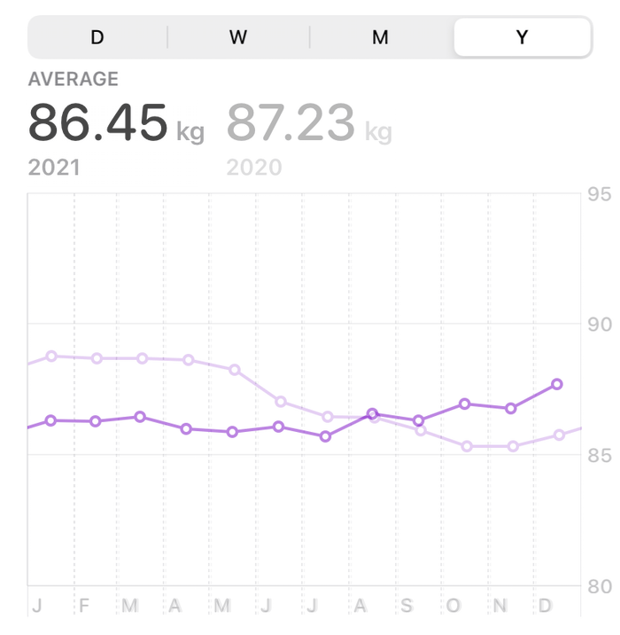
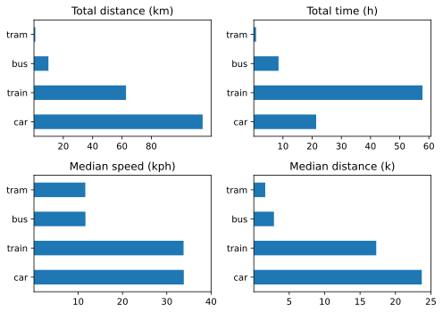
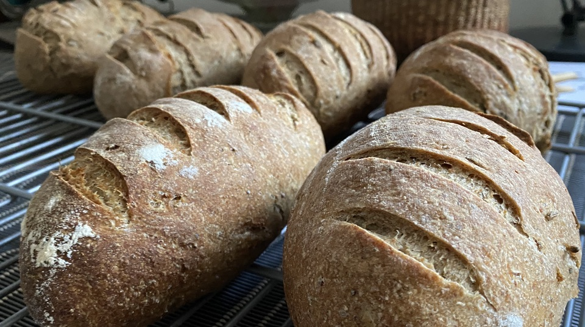

There is no escaping the fact that 2021 was (still) not a normal year, and I am not sure any year will ever be exactly comparable to the Before Times. There is too much residual self-care going on for that. And yet, and yet … it was a pretty good year, and I say that knowing full well how privileged I am. I share a pleasant space with a person who is the love of my life and my best friend, we eat well, and want for nothing. We got our vaccinations and boosters, we were able to travel a bit, within Italy, and we stayed healthy throughout. So, much to be thankful for and to appreciate.

===

All sorts of satisfaction came my way, some of it accompanied by money, and most of it chronicled in monthly updates. Most notable, I think, was replacing my desktop computer. I still have not finished bringing over all the bells and whistles that I had accumulated to ease my life on the old one, but I haven’t been held up for long either. The biggest single shift has been going on for much longer, and that is to move my image management out of Aperture and into Photo Mechanic. That’s a bit stop-start, and needs to finish up the old stuff so that I can get on and bring in new snaps, but eventually I think I will be up to speed. The other fun thing has been learning a bit of Python mostly for the heck of it and also to make certain repetitive tasks around here easier and more reliable. It has worked, although (as I said throughout the year) I need to keep up the momentum, on that as on everything else.

## Let’s go

- [By the Numbers](#numbers)
- [Media Consumption](#media)
	- [Books](#books)
	- [TV & Movies](#tv+movies)
- [Eat This Podcast](#etp)
- [Moving Forward](#moving)
- [Staff of Life Stuff](#bread)

## By the Numbers ##

All these were extracted the old-fashioned way, either by letting Apple Health tell me or by keeping a running count.

- Steps per day 10,040 (9144 in 2020)
- Active Energy 823 kcal per day
- BP systolic 115-143; diastolic 63-83
- Weight average was lower in 2021, but unlike 2020 is trending up rather than down. I need to focus on that again.

- Naps 181
- HIIT 116
- Read 203
- Podcasts 440 logged, a few more than that listened to

There are a bunch of other numbers I have (shaves, anyone?) but that really are not worth sharing; photos taken, locations saved, crap like that.

## Media Consumption

Ah, the pretentiousness of it. But I do keep [a log](https://jeremycherfas.net/blog/what-ive-watched.html) through the year and it is utterly surprising how I can have almost no recollection of things even though I noted them down. Here are some choices I do remember.

### Books

One of the nicest things I read all year was **Corduroy**, By Adrian Bell, the first part of a trilogy about becoming a farmer in Suffolk in the 1920s. Not too romantic, and left me wanting more, which will probably require haunting some second-hand bookshops when I get back to the UK. William Dalrymple’s **The Anarchy** was an eye-opener and set me up for much of the furore that blew up around colonialism in general. **The Screaming Sky**, by Charles Foster, was another great rural natural history read, about swifts by a swift obsessive. **The Corrections** by Jonathan Franzen was all absorbing in a watching-the-train-wreck kind of way. I very much enjoyed Elif Batuman’s **The Idiot** (gutsy title) for a view on a world I have no knowledge of, modern youth.

### TV & Movies

**Ethos**, a Turkish series on Netflix, was strangely beguiling for reasons I can’t quite put my finger on. Cross-cultural ethnography, very similar and at the same time very different? **The Dig**, a film about the excavation of Sutton Hoo, was wonderfully evocative. **Call My Agent** was a gem too, but like so many similar decisions I was befuddled by the news that they plan to make an English version. Is that for people who can’t/won’t read? Will they watch it? Rewatched **The Night Manager** from BBC and followed it up later in the year with **The Little Drummer Girl**. Both so very good and easily a match for **Le Bureau**, which we finally were sad to finish. **Tokyo Diner: Midnight Stories** was definitely the discovery of the year, just beating out **Shtisel** by a short head. **Black Earth Rising** from the BBC on Netflix was gripping and illuminating, with John Goodman at his very best.

## Eat This Podcast

I put out 19 episodes of [my podcast](https://eatthispodcast.com) this year, which I consider not at all bad for a one-person labour of love, which tries not to waste the listener’s time with idle chitchat and inconsequential blatherings. Also 29 issues of [Eat This Newsletter](https://buttondown.email/jeremycherfas) with links to many (I’m too lazy to count) food-adjacent stories. I also took the plunge and started sending an additional, private newsletter — three in total — to supporters of the show, though I did almost nothing to advertise that fact. Still, they seemed to be well received. Getting episodes into people’s ears remains the hardest thing to do and gets harder and harder as money floods into podcasting.

## Moving Forward

For ages now I have tracked myself through space using a variety of apps on my phone. The most thorough is undoubtedly [Wanderings](https://wanderin.gs/), which since January 2018 has stored my location and can display it all as a heat map. I don't need the heat map to tell me I have hardly been anywhere this past year.

Another app, [Overland](https://github.com/aaronpk/Overland-iOS), stores a whole lot more data about where I am, what I am doing, the state of my phone’s battery etc. etc. That too will show me a map of where I’ve been, and it also can record trips by specific modes of transport. Halfway through the year I started to use that in earnest, trying my best to remember to start and stop recording the trip whenever I wasn’t just walking about. Those data proved extremely handy as I tried to teach myself Python through the year, because a project that actually means something to me works a lot better for me than any dataset chosen by someone else.

So far, making use of the actual location data has been frustrating, although I mean to continue. Descriptive stats proved a lot easier to grasp and to work with. Here, then, are stats for all trips I recorded this year.

<table class="worktable">
<colgroup>
<col style="text-align:right;"/>
<col style="text-align:center;"/>
<col style="text-align:center;"/>
<col style="text-align:center;"/>
<col style="text-align:center;"/>
<col style="text-align:center;"/>
<col style="text-align:center;"/>
</colgroup>

<thead>
<tr>
	<th style="text-align:right;" colspan="2"></th>
	<th style="text-align:center;" colspan="2"><strong>Distance</strong> (km)</th>
	<th style="text-align:center;" colspan="2"><strong>Speed</strong> (kph)</th>
</tr>
<tr>
	<th style="text-align:right; width=20%"><strong>Mode</strong></th>
	<th style="text-align:center; width=20%">Number</th>
	<th style="text-align:center; width=15%">Mean</th>
	<th style="text-align:center; width=15%">Median</th>
	<th style="text-align:center; width=15%">Mean</th>
	<th style="text-align:center; width=15%">Median</th>
</tr>
</thead>

<tbody>
<tr>
	<td style="text-align:right;">Bicycle</td>
	<td style="text-align:center;">1</td>
	<td style="text-align:center;">2.2</td>
	<td style="text-align:center;">2.8</td>
	<td style="text-align:center;">15.8</td>
	<td style="text-align:center;">15.8</td>
</tr>
<tr>
	<td style="text-align:right;">Plane</td>
	<td style="text-align:center;">2</td>
	<td style="text-align:center;">646.8</td>
	<td style="text-align:center;">646.8</td>
	<td style="text-align:center;">328.0</td>
	<td style="text-align:center;">328.0</td>
</tr>
<tr>
	<td style="text-align:right;">Walk</td>
	<td style="text-align:center;">3</td>
	<td style="text-align:center;">21.3</td>
	<td style="text-align:center;">4.0</td>
	<td style="text-align:center;">4.0</td>
	<td style="text-align:center;">5.5</td>
</tr>
<tr>
	<td style="text-align:right;">Tram</td>
	<td style="text-align:center;">5</td>
	<td style="text-align:center;">1.8</td>
	<td style="text-align:center;">1.61</td>
	<td style="text-align:center;">12.2</td>
	<td style="text-align:center;">11.6</td>
</tr>
<tr>
	<td style="text-align:right;">Train</td>
	<td style="text-align:center;">8</td>
	<td style="text-align:center;">78.4</td>
	<td style="text-align:center;">172.8</td>
	<td style="text-align:center;">29.0</td>
	<td style="text-align:center;">33.8</td>
</tr>
<tr>
	<td style="text-align:right;">Car</td>
	<td style="text-align:center;">14</td>
	<td style="text-align:center;">82.1</td>
	<td style="text-align:center;">23.7</td>
	<td style="text-align:center;">36.6</td>
	<td style="text-align:center;">33.8</td>
</tr>
<tr>
	<td style="text-align:right;">Bus</td>
	<td style="text-align:center;">23</td>
	<td style="text-align:center;">4.3</td>
	<td style="text-align:center;">2.8</td>
	<td style="text-align:center;">12.1</td>
	<td style="text-align:center;">11.6</td>
</tr>
</tbody>
</table>

 
A few things of note:
- The single bicycle trip was on an e-bike.
- The walks were an experiment. I do not generally record walking.
- Distributions for train and car are markedly skewed, a few longer trips, many more shorter ones.

For further analysis, I decided to focus on only those modes of transport that I used more than three times. Making pretty pictures, as you see here, was more about learning to do so than about the extra insights that it would provide.

{.center}

Still, I find it interesting that we travelled much further by car than by train, and although median speeds were roughly equal, we spent far more time on train journeys than car journeys, probably because I counted waiting to change trains as part of the same trip.

Overall, though, I regard these data as a kind of baseline for future years. I don’t anticipate getting rid of the car just yet; it is too convenient for spontaneous out-of-town trips, but we barely use it in town. A total distance of 1150 km is not excessive. I need to ride my bikes more.

## Staff of Life Stuff

[{.center}](rye-lg.jpg)

I baked a lot of bread, specifically for friends on 30 different occasions. Total of those, 192 loaves of 10 different kinds. This year I really got a good workflow going, almost always letting the bulk rise take place overnight in the fridge. Then in the morning I would take out the dough and shape first the small loaves, then the large loaves, at roughly hour intervals so each got roughly the same amount of time to warm up. The only downside to this scheme was that a large number of loaves would mean I couldn’t leave the house until the last one was out and cooling, often after dark in the winter. Hey ho, still very rewarding (and not just financially).

As for 2022: bring it on.
