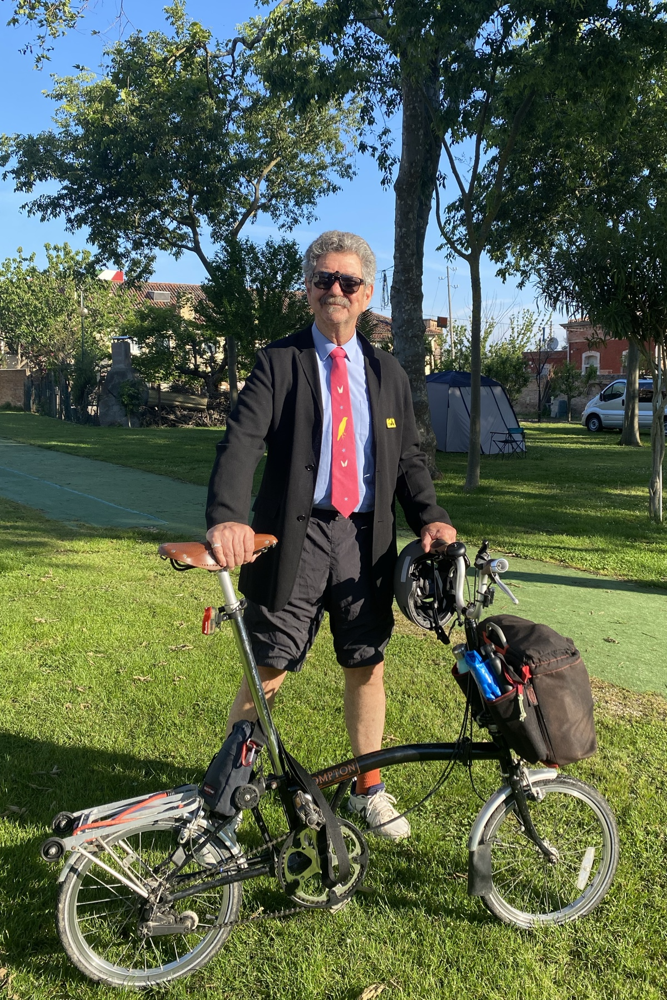
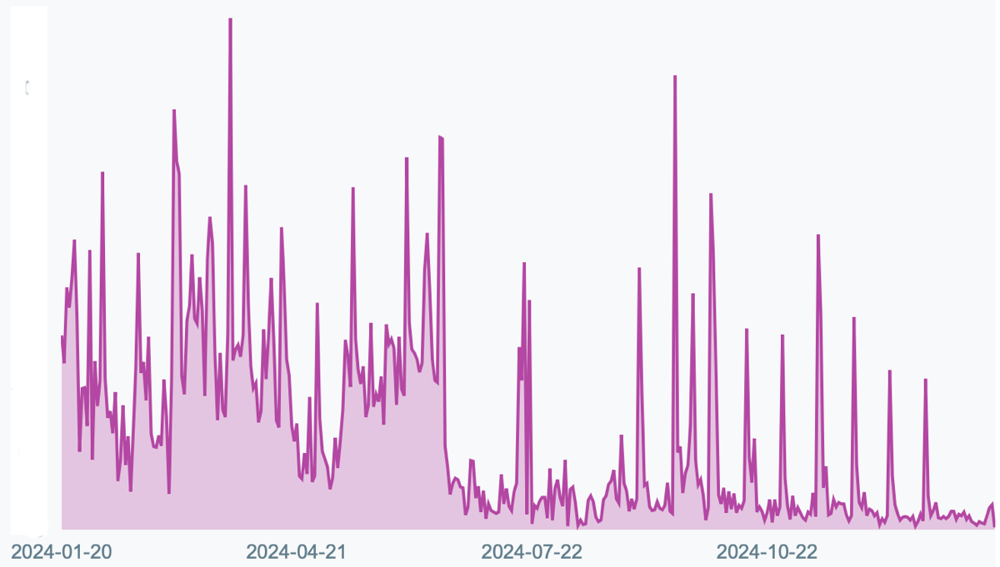
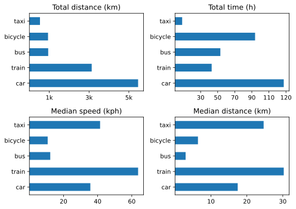
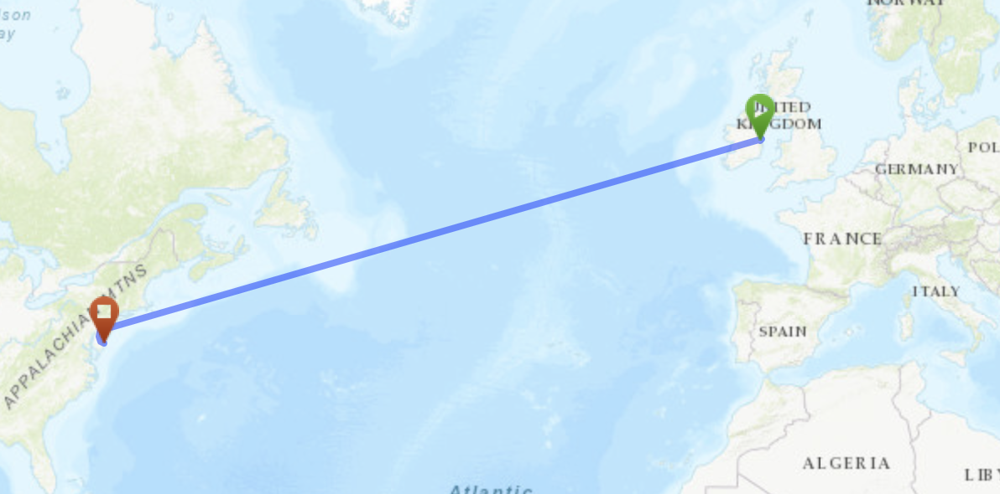
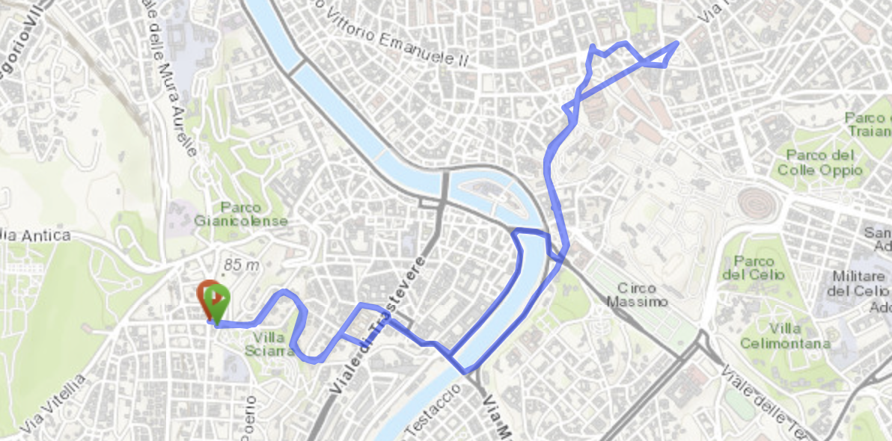

My CDO let me down recently, as I discovered that I had given my annual reviews at least three different kinds of title, and as I had also chosen to not give them their own tag, distinct from _Monthlies_, it was a bit of a pain finding them. As it is, four I still have not found, but I have another whole year to do that. If, indeed, they exist. And as I seem to have a general outline format, I shall continue to use that.

===

One of the most interesting activities of the year was a month in Northern Ireland. We got bounced into it, a bit, and I was somewhat worried, but in the end it turned out to be a really good month. We were in a very cozy modern house in Castlerock, with miles of beautiful beach to enjoy in what locals said was some of the best weather of the year. There wasn’t a whole lot to do but it was great to do it in an entirely new place. A couple of day trips around were good too, Derry in particular being very impressive. The centre is pretty forlorn, but one can imagine it coming back to life. And Malin Head was worth a lifetime’s wait listening to the shipping forecast.

The other best thing was a trip to Treviso and Venice as part of an organised outing to the Brompton World Championships in Mestre. The second day, cycling 95 km along the beautiful river Sile and the edge of the lagoon was the most fun I have had on two wheels since I was about 13. The actual BWC was a slight disappointment, but only because my expectations were so high. There was a bad accident on the course as I was finishing my 4th lap of 5, so the marshalls closed things off and I never did get to finish. Oh well, good fun all the same and fun to be in an all-Italian group, with one exception, for a few days.

{.center}

As I look back over the year I am once again struck by how little I have to complain about or regret. Without a hint of false modesty, life is very good indeed.

## A Bit More Detail
As before, I think I will more or less follow the precedent set by last year’s organisation.

- [By the Numbers](#numbers)
- [Media Consumption](#media)
	- [Books](#books)
	- [TV & Movies](#tv+movies)
- [Eat This Podcast](#etp)
- [Moving Forward](#moving)
- [Staff of Life Stuff](#bread)
- [And the Rest](#more)
- [Years Past](#previously)

## By the Numbers ##
All these were extracted the old-fashioned way, either by letting Apple Health tell me or by keeping a running count.

- Steps per day 8561 (8735, 9096, 10,040, 9144)
- Active Energy 724 kcal per day (757,767, 823, 685)
- Resting Heart Rate 54 bpm (53, 54, 54, 53)
- BP systolic 105–135 (127–135, 119–135, 115-143, 120-147); diastolic 64–81 (65–77, 69–77, 63-83, 55–81)
- Weight 89.06 (87.17, 88.24, 86.45, 87.23)
 
Do I need to graph these?

Last year I wondered about the decline in steps per day; that seems confirmed this year. Does it matter? I still don’t know. Active energy has declined too, and weight increased, so maybe a push to make the daily walk a little longer would be a good thing. Hard to know, really, and right now it doesn’t seem like that big a deal. Heart rate and blood pressure do not worry me.

Medically, all mostly good, although late in the year I started to have more pain in my arthritic left knee. Seems OK again right now, but might need some further attention.

- Naps 204 (175, 148, 181)
- HIIT 37 (51, 90, 116)
- Read 202 (199, 209, 203)
- Podcasts 259 (208, 325, 440) logged
- Bicycle rides 38 (Started counting properly in 2024)
 
High-intensity interval training still plummeting, still boring. I am definitely now out of the habit; the question is, do I want to get back into the habit? Part of me would like to find something a little more interesting, and that part of me is still tempted by Apple Fitness. Another part of me looks at Health’s versions of Cardio Recovery (22 bpm) and Cardio Fitness (above average) and thinks, well, that’s all OK. Then again, I probably need to stretch more. Naps remain a great blessing.

## Media Consumption
It is a good thing I keep [a log](https://jeremycherfas.net/what-ive-watched.html) of the various things I watch and read as the year rolls by, because when I look back there are plenty I can no longer recollect. Having reminded myself, here are some I do remember.

### Books
It was a really fine year for books. I loved _Orwell’s Roses_ by Rebecca Solnit for the way it wove everything together and told me new things about Orwell. Rebecca Yuang’s _Yellowface_ was challenging and entertaining in equal measure. I knew nothing about Erri de Luca when I picked up _The Day Before Happiness_, but loved it for the very spare storytelling and very gripping portrait of Naples. At the other end of the spectrum, _Napoleon: a life in gardens and shadows_ by Ruth Scurr was a long but illuminating portrait from an interesting point of view that made perfect sense after the fact. Colm Tóibín was perhaps my discovery of the year, both _Brooklyn_ and the sequel _Long Island_. Or maybe it was _Cahokia Jazz_, by Frances Spufford, which led straight to _Red Plenty_, both absolutely all-enveloping. And then there was _The Fraud_ from Zadie Smith, so much to learn, such fine storytelling.

### TV & Movies
Although we saw a fair number of movies, on TV and in the cinema, the one that sticks out is _Perfect Days_ by Wim Wenders, a lovely, gentle film, full of beautiful quiet touches.

On TV, _Ripley_ was very satisfying, as was _The Gentlemen_ and _Masters of the Air_. By contrast, _Presumed Innocent_ was a total cop-out. Perhaps the watch of the year, though, was the entire run of _Line of Duty_; old news to everyone else but we had never managed to see any of it before this year. Thanks, Ireland. _The Diplomat_ s02 was pretty good too.

## Eat This Podcast
Published 19 [episodes](https://eatthispodcast.com), including a remix of an older one, and 32 issues of [Eat This Newsletter](https://buttondown.email/jeremycherfas). Slightly surprised when I looked at some of the stats for the year. The three most popular were Baby Food, Pottery and Water. Fine episodes, each of them, but I’m puzzled that Anthony Mongiello and his stuffed-crust pizza didn’t get more listens. I also wonder whether the topic of women in butchery put people off. It is still early days for the anchovy extravaganza, which makes the point that one of the nice things about most episodes is that they are in a sense timeless, and that also means I need to be better about promoting the back catalogue. As for podcast competitions, I fear it is a permanently losing game, although there are a couple I think worthy of submitting somewhere, if only there were a category for one-person labours of love.

It’s odd. I don’t think there has been a huge drop-off in the peak listening (as recorded by Blubrry), but there are definitely far fewer people listening between episodes. No idea what is driving that. Could be the enshittification of Twitter, which I am no longer using at all. I can’t think what else it might be. Looking further back, it was also low up to about late 2023, so perhaps that’s actually the important baseline and I am worrying for nothing. Half the months in 2024 had more listeners than all months bar one in 2023, so yes, I **am** worrying for nothing. And the people who listen are **listening**; on average to about 88% of each episode.

## Moving Forward
Still recording various trips (but not walks) with [Overland](https://github.com/aaronpk/Overland-iOS) and still occasionally forgetting to end a trip at the end of the trip, which doesn't affect distance but does lower speed. Almost all are still underestimates. For the more frequent modes, though, that hardly matters. Here are the overall summary statistics:

|Mode|Number|Total Km|Mean Kph|
|---|---:|---:|---:|
|boat|16|175|3.9|
|plane|4|5400|624|
|taxi|12|533|26.1|
|tram|2|4| |
|metro|4|15|2.3|
|car2go|0| | |
|train|22|3133|63.5|
|bicycle|67|938|9.9|
|car|120|5466|20.7|
|bus|116|947|11.8|
   
To note:  
- Bicycle trips continuing up.
- No car sharing at all.
 
For further analysis, I focus on only those modes of transport that I used more than five times (excluding boats, natch).

{.center}

Hard to know what to highlight. Overall, the rankings are as they were before — no surprises in that — although the actual numbers are different. Quite a lot less time in the car, for example, and quite a lot further on the bicycle (and in taxis).

I like the idea that the two static maps, for the first and last days of the year, are a kind of bridge between one year and the next. New Years Day has never meant all that much to me, and this year we were in bed by 21:30, but if culture has decided on a special day, it is easier to go with the flow than decide I really want the new year to begin on, say, 22 March. Which I do.

{.center}

{.center}

## Staff of Life Stuff

Slightly down on last year, 120 loaves all told _versus_ 125 last year. Still, not too shabby. A couple of interesting one-off experiments, for us, but nothing to enter the rotation permanently. I do need to do the 100% rye with sunflower seeds again. I miss it.

## And the Rest
This section seems to be a graveyard of ideas, which makes me wary of adding anything this year. But maybe it is also an opportunity to commit publicly to the one thing I really want to do: redesign this site. There, I’ve done it.

## Years Past
A new section. It will take some spelunking to find 2016, 2017, 2019 and 2020 if they exist.  
* [Year in Review 2015](https://www.jeremycherfas.net/blog/year-in-review-2015) 
* [Year in Review 2018](https://www.jeremycherfas.net/blog/year-in-review-2018) 
* [Year in Review 2021](https://www.jeremycherfas.net/blog/year-in-review-2021) 
* [Year in Review 2022](https://www.jeremycherfas.net/blog/year-in-review-2022) 
* [Year in Review 2023](https://www.jeremycherfas.net/blog/year-in-review-2023)

! Hard to believe I had to spread the writing of this out over six days, but there it is.

[comment]: # (2024: use `concat_trips.sh` to build the full-year CSV. Don't forget to de-dupe. `summary-stats.ipynb` to make the 4-way graph)