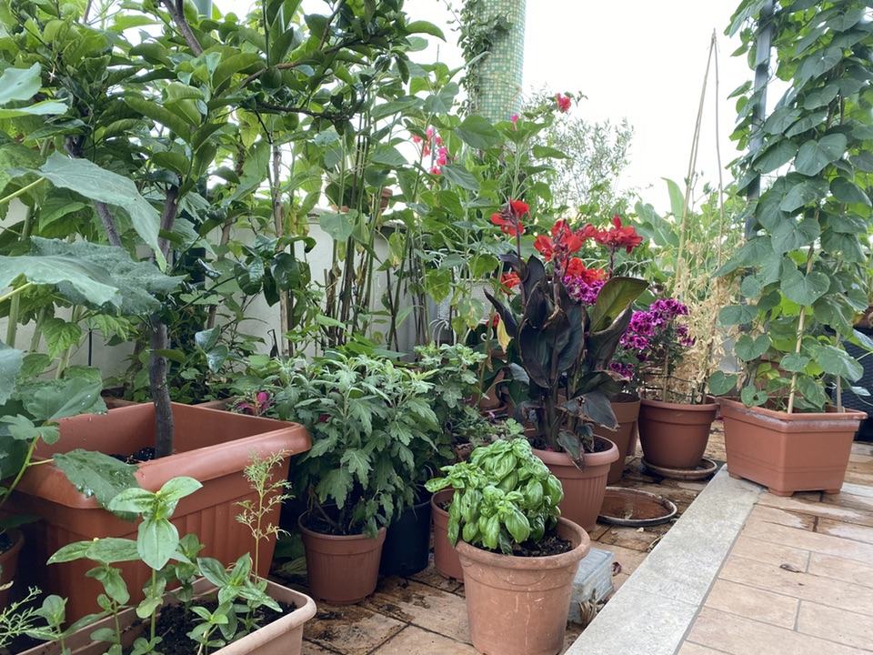

{.center}

The plants on the terrace are looking particularly lush and verdant this year, probably the result of a rather cool and extended spring. Now that the hot weather is here, keeping them watered is a constant problem, possibly the biggest problem of plants in containers (after the depredations of pests in an environment that does not encourage predators enough). The bigger the container, the easier it is, but we keep adding small pots of lovely plants that seem to dry out in minutes.

===

I’ve had an automated watering system for years now, and it has evolved through several iterations. At first I tried to fit each pot with its own dripper, roughly calibrated to the size of the pot. That worked, kinda sorta, although it drowned some plants while others fried, and with our hard water drippers often clogged. The tangle of tubes made moving any one pot a nightmare, too.

A couple of years ago I experimented with a few sprayers, hoping that the spray would cover several smaller pots, and that too worked, kinda sorta. Last year I increased the number of sprayers and added large trays that would capture water under a batch of several pots. That was the most successful version to date, and so this year I decided to go all in on sprinklers, reserving drippers only for the four most inaccessible pots.

It was a bust.

The problem is that the water pressure is too low, as a result of which the sprinklers merely dribble, depriving almost all the plants of any water while drowning the few directly under them.

After scads of research, I worked out that an inline pump would be the best option to increase the pressure, and after further research decided on a Gardena 3500/4. It was the smallest and least expensive pump that had the one feature that seemed indispensable: in the absence of water to pump, it switches itself off.

My reasoning went as follows. The watering system is on a (Gardena) timer, which isn’t brilliantly flexible but does a solid job of coming on for an hour every morning at 6am. When it stops the water flow, the pump will stop. And when it starts the water flow next morning, the pump will start again. 

Pump and fittings bought, I gave it a try, and was delighted that the sprinklers no longer dribbled but sprayed boldly. The water went off, and six minutes later the pump went off. But alas, when the water came on again, the pump did not start up. I was very, very disappointed and fired off an email to Gardena, the problem being that I couldn’t tell whether the pump was faulty, and should have started up again, or I was faulty in assuming that automatic switching off in the absence of water implied automatic switching on in its presence.

This was on Saturday. Over the weekend, I carried out a couple of experiments. I unplugged the pump after it had switched itself off, without touching the manual on-off switch. When I plugged it back in, it started up, and if I then opened the water flow manually, sprinkling ensued. By contrast, if the water was flowing _before_ I plugged the pump in again, the pump did not start and the system merely dribbled.

So the new “system”, such as it is, consists of a quasi-mechanical timer for the pump. This switches on a minute before the irrigation timer opens the flow. The pump will pump for the hour that the water is flowing, and then swtich off. About 15 minutes after the irrigation timer has shut off, the mechanical timer will cut power to the pump. And so on, each day.

That’s the plan. I have two days to ensure that it works before we leave for a holiday. I’ll be reporting back when we return.

Two additional notes:

To date, I’ve not had much use for home automation. If I need to switch on a light, I get up and switch it on. I envy people who want to do much more and are able to, but there’s been no incentive for me. However, I can now see considerable value in being able to automate and control a watering system and pump. Maybe I’ll do some research into HomeKit and irrigation once the winter rains start and by this time next year all these kludges will be a thing of the past.

As I mentioned, I emailed Gardena asking whether my pump was behaving as they expect, or might possibly be faulty. They replied:

> We would like to inform you that we do not have a central customer service department. Any kind of service will be handled by the sales organizations of the countries in which you live.

> Because we can not tell from your request which country you come from, please direct your request to the responsible subsidiary which you can find here on our website:

Is that not the most pointless excuse for an answer ever? Not to mention a pointless contact form on a website. I’ve replied, saying I don’t want “any kind of service”. I want an answer to my question, which I would have thought head office would be able to supply.

